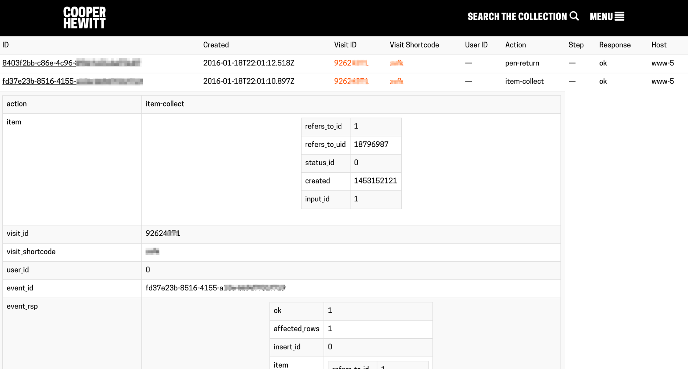
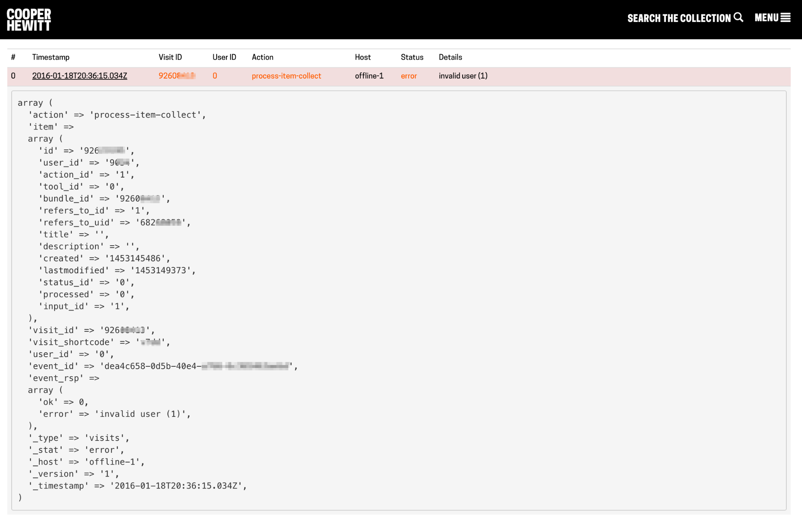

# Log Files

Mentioned previously, the systems and services at CHDSM create millions of log messages. These messages are written as files on disks and are generated for a wide variety of reasons including the tracking of events happening with the Pen. 

As an example, Diagram 01 illustrates a typical log message created when a visitor returns their pen at the end of their visit.

Diagram - 01

The first message, which is collapsed in Diagram 01, is the “pen-return” log, indicating that the pen was returned, and all the details about its safe return. The second message, also illustrated in Diagram 01, happened just before the “pen-return” and is an “item-collect” event. This refers to an object that the Pen was used to collect. In the boxes below, most of the details (some blurred for privacy reasons) about the item that this Pen was used to collect are visible. The system knows which object it collected ([18796987](https://collection.cooperhewitt.org/objects/18796987)) what time the object was collected, and which visit it has to do with (also blurred). These log messages are stored on a server within CHSDMs data infrastructure, but as illustrated here, CHSDM has developed a simple interface so staff can view these logs at anytime from an administration area on one of its websites.

At the digital tables, a [Near Field Communication](https://en.wikipedia.org/wiki/Near_field_communication) (NFC) reader board, downloads all the data off the visitor’s Pen. This data is then formatted and sent to the Pen API which processes the data and stores it before responding by displaying the items that the visitor collected on the screen in front of them. This operation invokes several log messages, recording every step in the process. If something were to go wrong during one of these steps, CHSDM staff would be able to see an error message like the one in Diagram 02, which would allow CHSDM staff to diagnose the problem with the underlying system. 

In this case, the API responded with an “invalid user” error. This was probably a configuration problem with one of the underlying systems. A log like this can be used to diagnose issues like this one, and the ability for CHSDM staff to look at this data, from within an administration panel makes it possible for CHSDM staff to quickly resolve these kinds of problems.

Diagram 02

