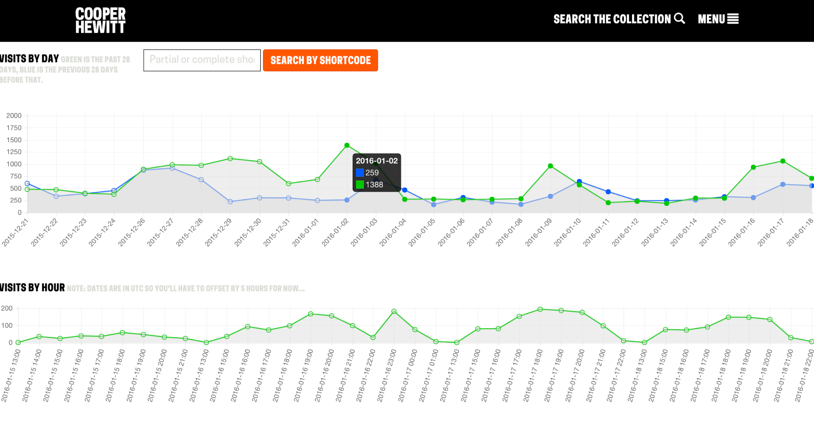

# Logstash

CHSDM have begun to develop millions of log files, stored on a multitude of systems. Log files are typically are stored on the systems that generate them, and CHSDM have many of these systems. Log files are stored on server instances within Amazon Web Services cloud, our data center in Herndon, Vriginia, and locally on PCs and [Raspberry Pi](https://www.raspberrypi.org/) computers in numerous locations throughout the museum.
 
In order to better deal with all of these logs, CHSDM have employed an open source system called [Logstash](https://www.elastic.co/products/logstash). Logstash works a conduit which log messages travel through. As systems generate log files, they are sent to Logstash which formats and processes in to a variety of outputs. 

Logstash can be highly customized, allowing CHSDM to store copies of its logs in multiple locations and in multiple formats. At CHSDM logs get processed into text files. Additionally, each log message is formatted into JSON which is then inserted into an [ElasticSearch](https://www.elastic.co/products/elasticsearch) index for ease of access and search-ability. This ElasticSearch index is used to create the administration pages illustrated in Diagram 01 and Diagram 02. These administration pages, leveraging the data generated by the logs, have become one of the main diagnostic and analytics tools for the entire system at CHSDM. 

Diagram 03

Logstash comes packaged with an application known as [Kibana](https://www.elastic.co/products/kibana). (Illustrated in the Diagram 03). Kibana is an analytics tool which allows one to search through data stored in an ElasticSearch index. At CHSDM, Kibana has proven to be a very useful tool. It is easy to set up, and a great way to develop ideas around how one might use log data to gain insights. 

However, CHSDM eventually found Kibana a little limited in what it could do. It also became troublesome to expose Kibana on the public Internet, allowing CHSDM staff to log in from anywhere to investigate a problem. So that CHSDM staff could take control over how it analyzes and accesses its logs, CHSDM staff decided to begin building administration pages that would allow one to view the data stored in its Logstash generated, ElasticSearch dataset.

Below is a series of diagrams of example log pages. CHSDM have built in graphic functions to provide a simple data visualization of what has been happening over time. CHSDM staff plan to expand the facility of these administration pages in future iterations.

**Administration Diagrams**

Diagram 04

Pictured in Diagram 04 are two graphs representing “visits.” The top graph is “visits by day” where the green line represents the past 28 days, and the blue represents the 28 days prior. Pictured below are visits by hour. With this simple diagnostic tool CHSDM staff can easily see which days and times are the most active in the galleries.

