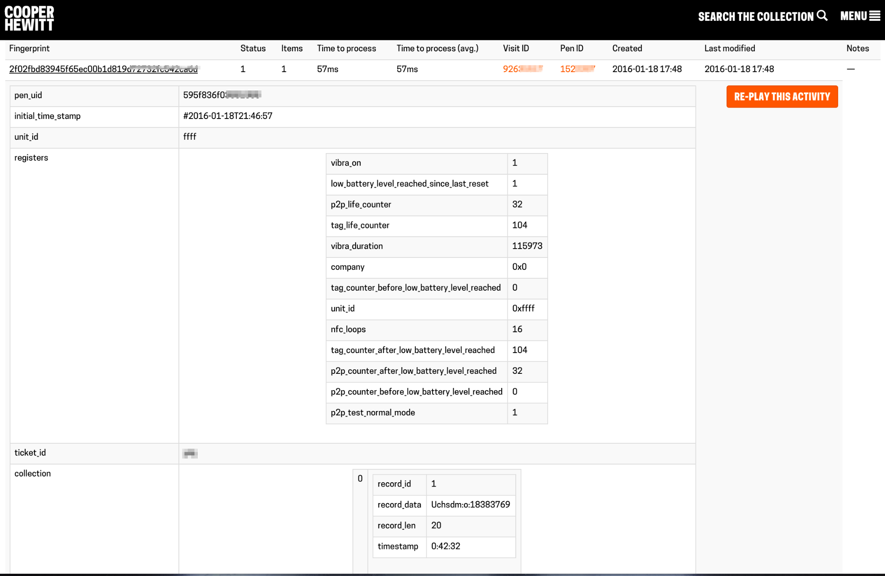

# Re-play & Failing Gracefully

Another incredibly useful aspect of logging data has to do with the concept of replay and graceful failure. In a complex system with many moving parts, it’s only a matter of time before something breaks. Typically it’s one small piece of the larger complex system. It would be a shame that one single issue would result in our visitors not being able to have an enjoyable visitor experience, so we try to do our best to “fail gracefully.” This idea means that if one small part of the system goes down or is temporarily unavailable, the rest of the parts can continue to operate. Since each system produces log messages for every action it performs, the part that was temporarily down can typically be “replayed” once it has recovered.

Here is an example. Let’s say a visitor arrives at the museum and purchases a ticket. This invokes a series of requests to a collection of different services. First the ticket is created using our Constituent Relationship Management ( CRM ) system known as Tessitura.  Once the ticket has been purchased and printed, it is scanned, and tested to ensure it is valid. Then the ticket is “paired” with a pen which is handed to the visitor for the duration of their visit. If during this process there is a failure with the system that pairs the visitor’s ticket with their Pen, a problem would occur that would normally not allow the visitor services staff to issue the Pen. This could potentially cause a backup at the visitor services desk, resulting in many frustrated customers.

Instead of issuing an error, we simply write the log message to disk, and allow to the system to carry on as if everything has worked. Later, when the pen pairing API is back online, our system can go through these log messages and “reply” the events that failed to work, ultimately presenting the visitor with a seamless experience.

As you might imagine, this doesn’t always play out as well as it sounds. For example, in this scenario, if the visitor’s pen was not successfully paired with their ticket and they went to visit their personal website, they wouldn’t see any of the things they’d collected during their visit. The idea here is that this will eventually become available to them, ideally before they check, but in any case, at some point in the future.

The diagram above illustrates what this might mean. In this example we can see that a Pen was used to collect object 18383769. If the visitor got home and didn’t see this object on their website as expected, they would hopefully send us an email explaining their issues. Because we have a log of this event taking place, we are able to easily press the “Re-Play This Activity” button, which would re-process this event, thus allowing the visitor to see the expected result.

Without this type of intensive logging, we wouldn’t be able to recreate the experience. In this instance we have the potential for a visitor to become temporarily frustrated, but we’ve also ensured that we can eventually alleviate this frustration by replaying the events and producing the expected outcome.