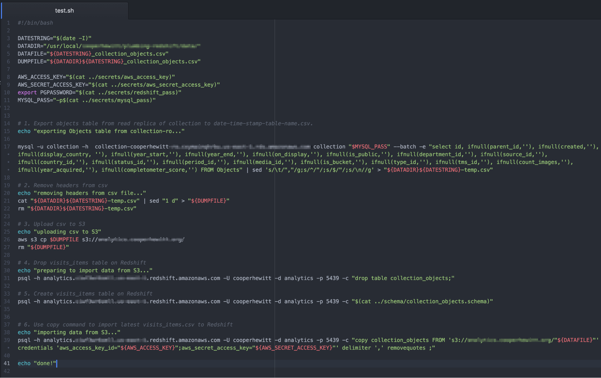

# Data Transfer and Ingestion

CHSDM experienced difficulty in getting all of its data into Redhsift, getting it there safely and securely and getting it there periodically. Amazon offers a number of tools and tutorials to make this part easier, but this has been one of the biggest hurdles to overcome with using this type of system so far.

The steps are:
	
1. Identify the data source
2. Map the data source to a Redshift compatible schema
3. Export the data to a CSV file
4. Upload the CSV file to Amazon S3
5. Use the Redshift COPY command to import the CSV from S3

