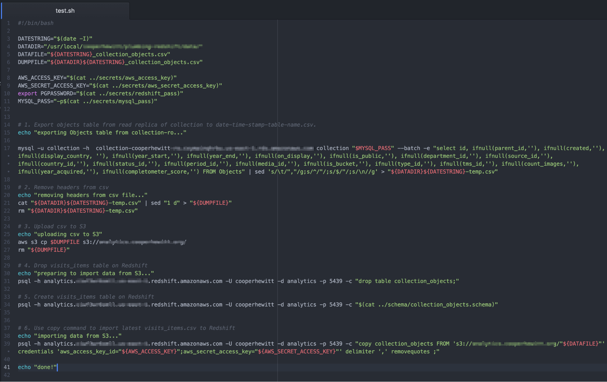

# Data Transfer and Ingestion

CHSDM experienced difficulty in getting all of its data into Redhsift, getting it there safely and securely and getting it there periodically. Amazon offers a number of tools and tutorials to make this part easier, but this has been one of the biggest hurdles to overcome with using this type of system so far.

The steps are:

1. Identify the data source
2. Map the data source to a Redshift compatible schema
3. Export the data to a CSV file
4. Upload the CSV file to Amazon S3
5. Use the Redshift COPY command to import the CSV from S3

Diagram 08

There is a good deal of engineering to be done around the five steps listed above. Mapping data from multiple databases and log file systems is complex and requires a lot of time and typing. To automate the process defined above CHSDM staff have developed simple shell scripts that can be run on a nightly basis. These each connect to [read-replica’s](https://aws.amazon.com/rds/details/read-replicas/) of live data, which mean that there isn’t an issue with the exports disturbing the live environments.

Pictured in Diagram 08 is an early prototype of a shell script for doing the steps listed above. A few details are blurred out for privacy reasons.

CHSDM staff have been experimenting with one-directional hashing of values such as user ids and personal information using [bcrypt](https://en.wikipedia.org/wiki/Bcrypt) and other cryptographic techniques. These techniques work but they can be resource intensive.

Getting all the above setup is tedious and is still largely a work in progress at CHSDM.
