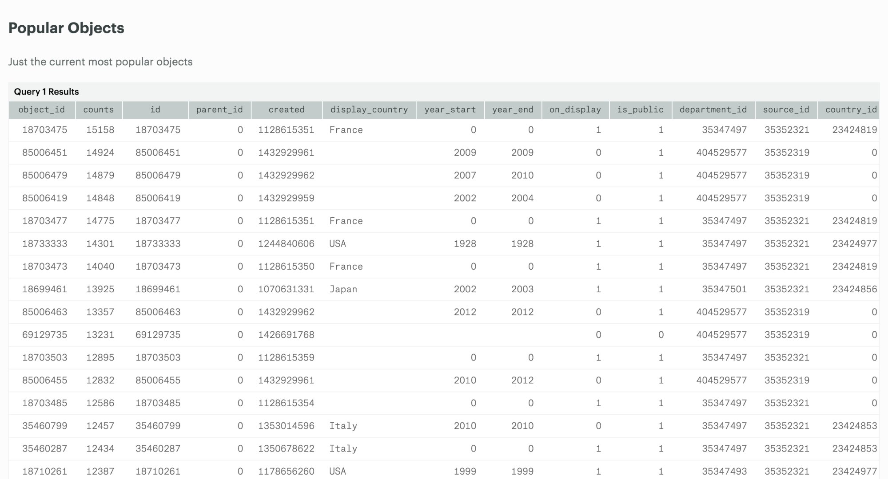
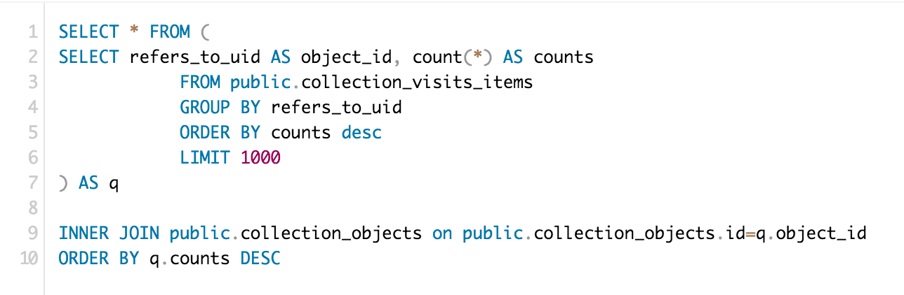
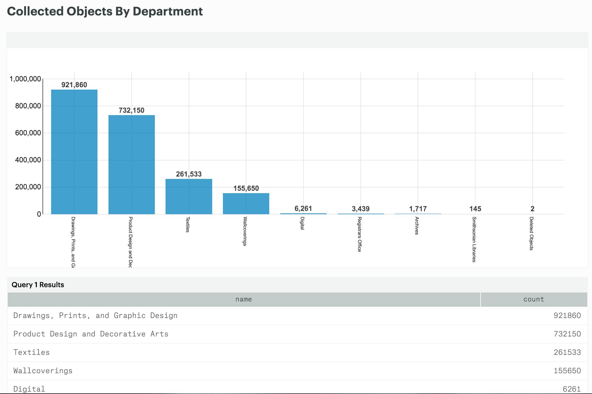
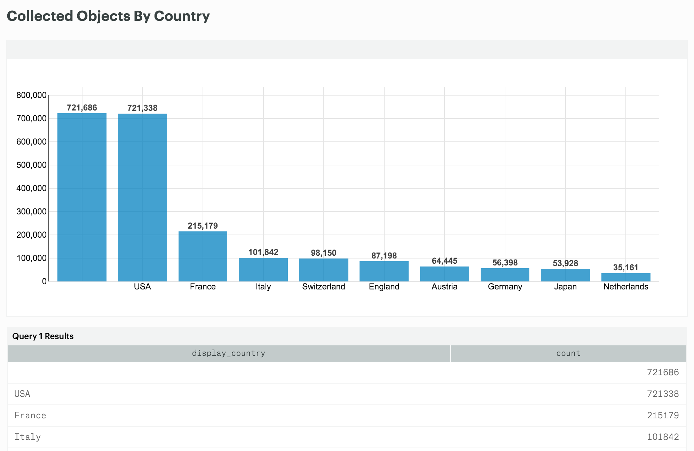
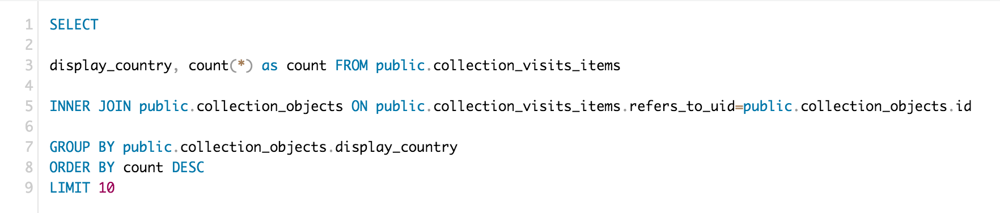
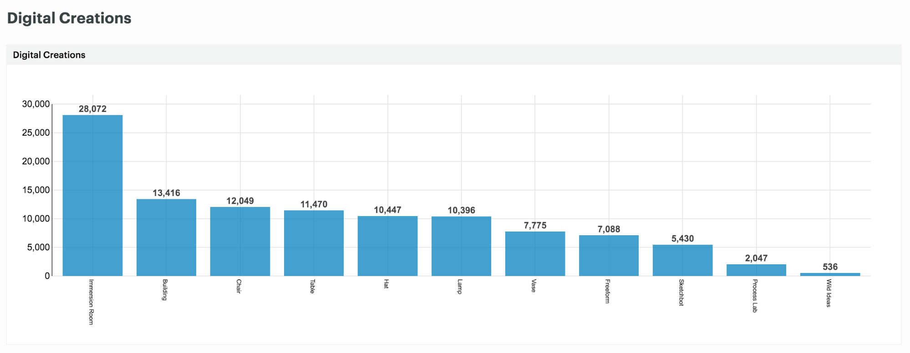
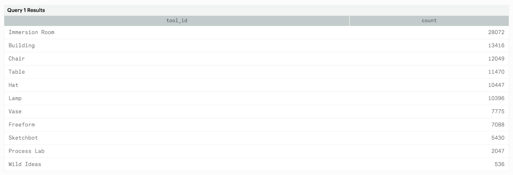
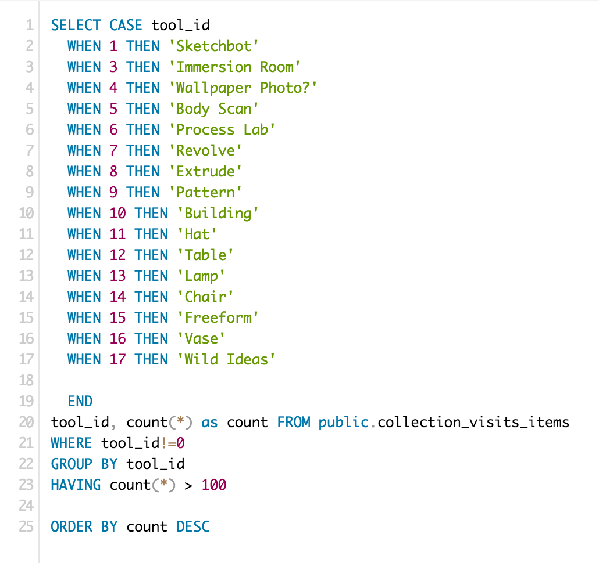

# Visualizing the Warehouse

Immediately, one can query Redshift using a simple Postegresql compliant client like psql. psql lets you connect to a Redshift cluster and query the data using standard SQL. The results are sent back in text form. It’s typically the first tool one might use to test a connection and start building basic queries.

However, it’s pretty easy to see that writing SQL on the command line and making sense of results from Redshift can be a little bit of a hassle. Additionally, while it’s pretty easy for a developer or data analyst to log into Redshift via the psql client, it’s pretty much impossible to imagine any other staff member doing the same. The next step in building a data warehouse is to attach some kind of analytics tool on top of it that makes the retrieval of data, generation and sharing of reports much easier.

There are a number of off-the-shelf solutions for working with data in a warehouse like Redshift. CHSDM have taken a close look at many of them.

1. [Periscope](http://periscope.io) is a powerful set of business intelligence tools that can connect to a wide variety of data sources including Redshift. It allows you to build SQL based queries through a web interface and chart results using a series of customizable charts types. The reports can be shared with colleagues and easily updated to reflect live data.
2. [Chart.io](http://chart.io) is very similar to Persicope. 
3. [ModeAnalytics.com](http://modeanalytics.com) is also very similar to Periscope and Chart.io but a little more simplistic and much less expensive. After a trial period CHSDM found Mode to do most of what they wanted to accomplish. The main feature CHSDM were interested in, being able to design an SQL statement and then export the results to Excel, seemed to work perfectly out of the box.

Below is a series of diagrams illustrating some of the reports CHSDM have generated using Mode, connected to its RedShift cluster on AWS. These are mainly first efforts and prototypes, but they illustrate the scenario CHSDM is trying to achieve.

Diagram 09

**Popular Objects** - One of the first thoughts CHSDM had was to report on the most popular objects collected with the Pen. “Popular Objects” quickly became the topic of many meetings, and it is now available via a [public statistics page](http://collection.cooperhewitt.org/stats).

Pictured in the Diagram 09 is how Mode can simply generate a table of data. This data can easily be exported to a CSV file or Excel spreadsheet.

Below, pictured in Diagram 10, is the SQL used to generate this report. It’s pretty straightforward, but the main point is the INNER JOIN on collection_objects and “q” which in this case refers to collection_visits_items. Within our current topology, these two tables are stored in different databases, making a simple join like this impossible.

Diagram 10

**Collected Objects By Department** - Here, CHSDM staff have grouped collected objects by Department as seen in the Diagram 11. Since the warehouse joined this data with collection data, it's possible to read the full text description of each department within the report.

Diagram 11

**Collected Objects By Country** - Here is another report based on the same data and joined with the collection data. In this case CHSDM are able to group the collected objects by their country of origin. This type of report can be revealing, and helps CHSDM staff to see how its visitor behavior, combined with its curatorial voice start to play out and display bias towards one thing or another. 

Diagram 12

Below is the simple SQL required to make this query in Redshift via Mode.

Diagram 13

**Digital Creations** - Lastly, CHSDM have created a report having to do with Digital Creations, or the things its visitors have created using the interactive tables. This report only uses the data stored in the Pen database but one can see how CHSDM used simple SQL to modify the report right in Mode so it has labels on the axis and skips unnecessary items.

Diagram 14

Diagram 15

Diagram 16